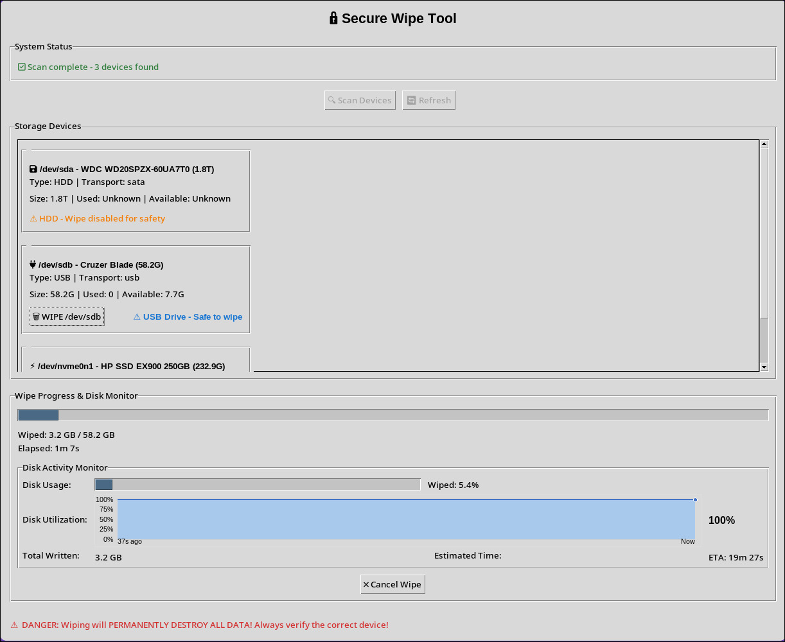

# Secure Wipe Tool

A professional storage device secure wipe identifier and command generator.

## Project Structure

```
secure_wipe/
├── core.py          # Core business logic - device detection & classification
├── gui.py           # Desktop GUI interface using tkinter
├── cli.py           # Command-line interface  
├── run_gui.sh       # Shell script to properly launch GUI with sudo
└── README.md        # This file
```

## Why Each File is Necessary

### 🧠 `core.py` - The Brain
- **Purpose**: Contains all the device detection and classification logic
- **Why needed**: Separates business logic from UI, making it reusable
- **What it does**: Scans devices, classifies them (HDD/SSD/NVMe/USB), generates wipe commands

### 🖥️ `gui.py` - Desktop Interface  
- **Purpose**: Graphical user interface for easy point-and-click operation
- **Why needed**: Most users prefer GUI over command line
- **What it does**: Provides buttons, progress bars, and formatted results display

### 💻 `cli.py` - Command Line Interface
- **Purpose**: Terminal-based interface for power users and automation
- **Why needed**: Allows scripting, automation, and remote usage
- **What it does**: Provides `scan`, `status`, `device` commands with arguments

### 🚀 `run_gui.sh` - GUI Launcher Script
- **Purpose**: Properly launches GUI with root privileges and X11 access
- **Why needed**: Fixes the "Authorization required" error when using `sudo` with GUI
- **What it does**: Grants X11 access, runs GUI with proper permissions, cleans up

## Quick Start

```bash
# Use GUI (recommended for most users)
./run_gui.sh

# Use CLI (for automation/scripting)
sudo python3 cli.py scan --verbose
sudo python3 cli.py status

# Direct usage (if you understand X11 issues)
sudo -E python3 gui.py
```

## Requirements

- Python 3.6+
- Linux system with standard tools: `lsblk`, `smartctl`, `hdparm`, `nvme`
- Root privileges for device access
- X11 display server (for GUI)

## Security Warning

⚠️ **DANGER**: The generated commands will **PERMANENTLY DESTROY ALL DATA** on target devices. Always verify device paths before execution!

## Features

- **Modern, Safe GUI**: Scan, select, and securely wipe USB/NVMe/HDD/SSD drives with a single click.
- **Device Safety**: Only USB drives are wipe-enabled by default; other drives are protected unless you change the code.
- **Live Progress**: See wipe progress, total written, and ETA in real time.
- **Disk Usage Bar**: Visualizes how much of the device has been wiped.
- **Utilization Graph**: Theme-matched, full-width sparkline shows real-time disk activity (I/O %util) with no distracting background, blending with the app's look.
- **Immediate Cancel**: Cancel button instantly stops the wipe (kills all related processes safely).
- **No Data Loss by Accident**: Confirmation dialogs and clear device info for every wipe action.
- **Works with Sudo/X11**: Use `run_gui.sh` for hassle-free GUI launch as root.

## Screenshots



## FAQ

**Q: Why does the utilization graph look different from other apps?**
A: The graph is designed to match the app's neutral gray theme, with subtle blue for activity and black text for clarity. No extra background, no clashing colors.

**Q: How do I enable wiping for non-USB drives?**
A: Edit the `gui.py` and change the device type check (search for `if device["classification"] == "USB"`).

**Q: The GUI doesn't launch as root!**
A: Always use `./run_gui.sh` to handle X11 permissions automatically.

---

For more details, see the comments in each file or open an issue.
